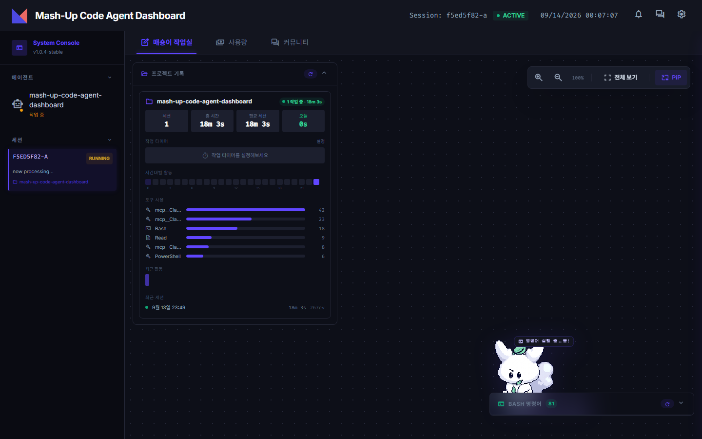
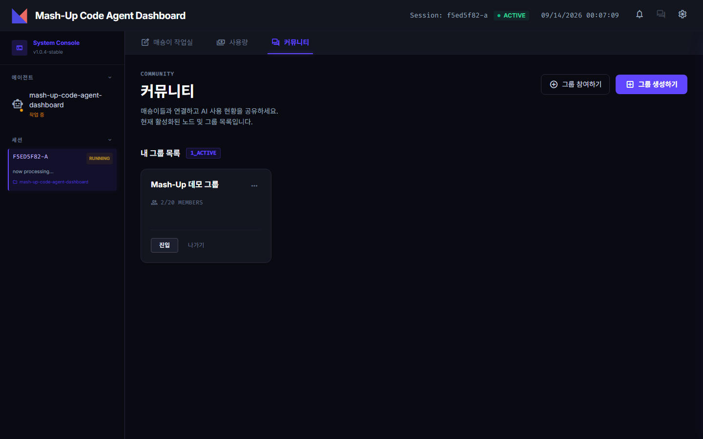
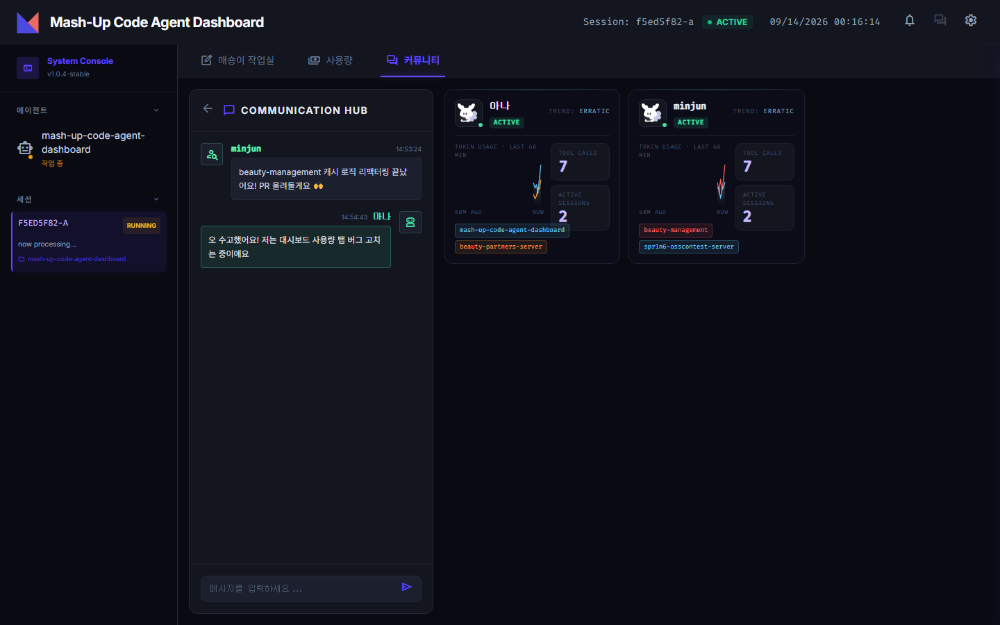
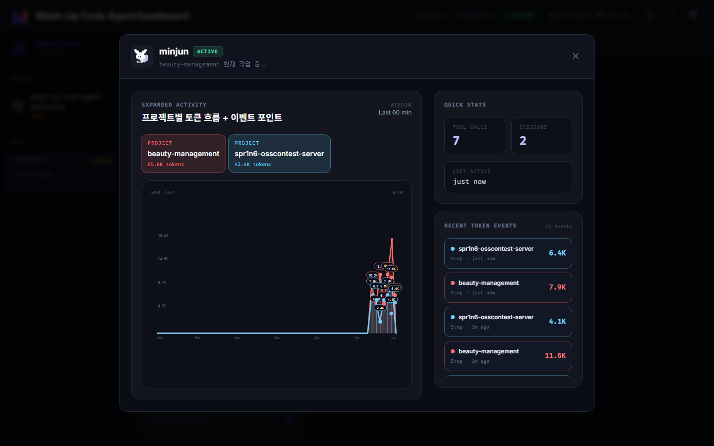

# Mash-Up Code Agent Dashboard

Claude Code 세션의 실시간 활동을 시각화하고, 토큰 사용량을 프로젝트별로 추적하고, 팀원들과 그룹을 만들어 서로의 작업 현황을 보며 채팅할 수 있는 **로컬 우선(local-first) 대시보드**입니다.

```bash
npm run install:local   # 로컬 전용 (작업실 + 사용량 탭)
npm start                # http://localhost:4321
```

커뮤니티(파티) 기능은 별도 설정 없이 배포된 서버에 바로 연결됩니다. 자세한 내용은 [빠른 시작](#빠른-시작)을 참고하세요.

---

## 기능

### 1. 매숑이 작업실 — 세션 실시간 시각화

Claude Code 훅(`PreToolUse`, `PostToolUse`, `SessionStart`, `Stop` 등)을 로컬 대시보드로 전송해, 지금 이 순간 어떤 세션이 무슨 작업을 하고 있는지 실시간으로 보여줍니다.



- 현재 실행 중인 세션과 상태(`RUNNING` / `IDLE` / `ENDED`)
- 프로젝트별 도구(Tool) 사용 횟수, 시간대별 활동 히트맵
- 최근 실행한 Bash 명령어 모음 및 빈도 분석
- 세션당 작업 타이머, 최근 세션 히스토리

> 사용량 탭과 달리 이 탭은 로그 파일을 자동으로 감지하지 않습니다 — Claude Code 훅을 먼저 연결해야 동작합니다. 연결 방법은 [빠른 시작 · 작업실 훅 연결](#작업실-훅-연결)을 참고하세요.

### 2. 사용량 — 프로젝트별 토큰 추적

`~/.claude/projects/**/*.jsonl` 로그를 증분 파싱해 토큰 사용량을 로컬(SQLite)에 집계합니다. 별도 서버나 API 키 없이 설치 즉시 동작합니다.


- 5시간/7일 rate limit 사용률 (Claude Code statusline 훅 기반)
- 최근 7일 내 활동한 세션 수


- 최근 7일 일별 토큰 사용량을 모델별 색상으로 구분한 스택 막대 그래프
- 막대에 마우스를 올리면 모델별 정확한 토큰 수 확인 가능


- 프로젝트별 총 토큰, 세션 수, 캐시 효율(`cache_read / (input + cache_creation + cache_read)`), 마지막 활동
- 아코디언을 펼치면 세션별 상세(사용 토큰, 모델, 캐시 효율, 마지막 활동) 확인
- 현재 활성 세션은 "실시간" 배지로 우선 표기

원리와 설계 트레이드오프(로그 파싱 vs OpenTelemetry, 파일별 순차 파싱 큐 등)는 [docs/usage.md](docs/usage.md)에 정리되어 있습니다.

### 3. 커뮤니티 — 그룹으로 함께 보는 팀 현황 + 채팅

로그인 후 그룹을 만들거나 8자리 초대 코드로 참여하면, 그룹 멤버들의 작업 현황을 실시간으로 공유하고 채팅할 수 있습니다.



- 참여 중인 그룹 카드 목록, 초대 코드로 그룹 생성/참여



- **그룹 대시보드**: 멤버별 온라인 상태, 최근 60분 토큰 스파크라인, Tool Calls 수, 활성 세션/프로젝트 목록 — 한 멤버가 동시에 여러 프로젝트에서 작업 중이면 프로젝트별로 색이 다른 그래프가 카드 하나에 겹쳐서 그려짐
- **그룹 채팅(COMMUNICATION HUB)**: SSE 기반 실시간 채팅, 그룹별로 분리된 대화방 — 위 화면은 두 멤버가 실시간으로 주고받은 실제 메시지



- **멤버 상세**: 카드 클릭 시 프로젝트별(위 화면은 2개 프로젝트 동시 작업 중) 최근 60분 토큰 흐름 그래프, Tool Calls/Sessions/Last Active, Recent Token Events 로그 확인

이 기능은 로컬 대시보드와 분리된 커뮤니티 백엔드(`server.community.js`)와 통신하며, 기본값으로 배포된 서버를 사용합니다. API/데이터 모델 명세는 [docs/community-feature-spec.md](docs/community-feature-spec.md)에 정리되어 있습니다.

---

## 빠른 시작

### 로컬 전용 (작업실 + 사용량)

```bash
npm run install:local
npm start
```

MySQL이나 선택 의존성(`bcrypt`, `express-session`, `mysql2`) 없이도 작업실/사용량 탭은 바로 동작합니다. 단, 작업실 탭은 훅을 연결해야 활동이 잡히기 시작합니다 — 바로 아래 참고.

### 작업실 훅 연결

사용량 탭은 `~/.claude/projects` 로그를 자동으로 감지하지만, 작업실 탭은 Claude Code 훅이 명시적으로 연결되어 있어야 세션 활동을 받습니다.

```bash
./setup-hooks.sh --project   # 이 프로젝트에서 실행하는 Claude Code 세션만 연결
./setup-hooks.sh             # 모든 프로젝트(전역, ~/.claude/settings.json)에 연결
```

훅을 연결한 뒤 Claude Code로 평소처럼 작업하면, 그 활동이 그대로 작업실 탭에 실시간으로 잡힙니다.


---

## 기술 스택

- **서버**: Node.js, Express 5
- **로컬 저장소**: SQLite(`better-sqlite3`) — 사용량 로그 집계
- **커뮤니티 저장소**: MySQL(`mysql2`) — 회원/그룹/채팅
- **실시간 통신**: Server-Sent Events (세션 이벤트, 사용량 갱신, 그룹 멤버 현황, 채팅)
- **파일 감시**: `chokidar` — `~/.claude/projects` JSONL 증분 파싱
- **프론트엔드**: 정적 HTML/CSS/JS (`public/`), 빌드 도구 없음

## 문서

- [docs/usage.md](docs/usage.md) — 사용량 탭 기능 명세 및 설계 고민
- [docs/community-feature-spec.md](docs/community-feature-spec.md) — 커뮤니티/그룹/훅 메트릭 API 명세
- [docs/기능 명세.md](<docs/기능 명세.md>) — 커뮤니티 그룹 기능 및 사용량 탭 전체 명세
